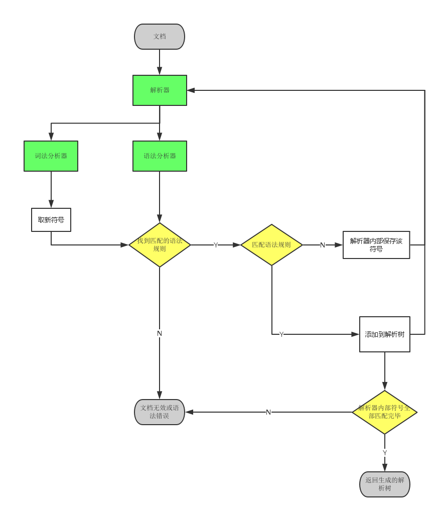
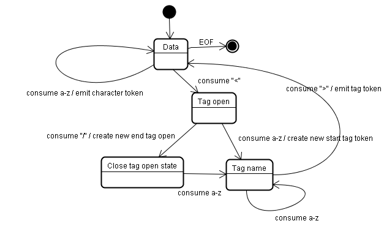

## 浏览器如何工作？

### 一、浏览器的主要构成

简单来说浏览器可以分为两部分，shell+内核。

Shell是指浏览器的外壳：例如菜单，工具栏等。主要是提供给用户界面操 作，参数设置等等。它是调用内核来实现各种功能的。

内核才是浏览器的核心。内核是基于标记语言显示内容的程序或模块。


常见的浏览器内核可以分这四种：Trident、Gecko、 Presto、Webkit。

浏览器一般由以下组件构成 ：

1. **用户界面**：浏览器软件界面
2. **浏览器引擎**：查询及操作渲染引擎的接口，创建UI后端组件等
3. **渲染引擎**：显示请求的内容，也即渲染html文档
4. **网络**：完成网络调用，发送和响应http请求
5. **UI后端**：绘制组合框，对话框等，具有不特定于某个平台的通用接口,底层使用操作系统的接口
6. **JavaScript解释器**：解释执行JavaScript代码
7. **数据存储**：浏览器持久层，cookie，localStorage，database（html5）等等


>【注意：】浏览器的执行时多线程的，但JavaScript引擎的执行时单线程。所以说浏览器是单线程的这种说法不对！


### 二、渲染引擎

渲染引擎根据各浏览器厂商实现各有不同，比如Firefox使用Geoko——Mozilla自主研发的渲染引擎，Safari和Chrome都使用webkit。

Webkit是一款开源渲染引擎。[webkit源码下载](https://webkit.org/downloads/)

#### 1、主流程
渲染引擎首先通过网络获得所请求文档的内容，通常以**8K分块**的方式完成。

基本流程：


> 即：请求HTML ==> 解析HTML ==> 构建DOM树 ==> 构建render树 ==> 绘制reder树。

webkit主流程：


Mozilla的Geoko 渲染引擎主流程:


>【注意:】这个渲染过程是逐步完成的，也即解析完一部分就执行一部分。


#### 2、解析

解析一个文档即将其转换为具有一定意义的结构——编码可以理解和使用的东西。解析的结果通常是表达文档结构的节点树，称为解析树或语法树。

举个栗子：
> 表达式： "2 + 3 - 1"
> 
> 返回解析树：
> 
> 

##### 解析文法

传统解析文法：
上下文无关文法

HTML文档解析（非上下文无关文法）：
DTD（Document Type Definition 文档类型定义）

##### 解析器
解析器有两个子过程：

- 词法分析器
   
- 语法分析器

解析过程：



解析结果：解析树。


#### 3、转换
将解析树转换成机器码。

#### 4、编译流程


#### 5、HTML解析

DOM树，也就是解析树，由DOM元素及属性节点组成的。DOM是文档对象模型的缩写，它是html文档的对象表示，作为html元素的外部接口供js等调用。

树的根是“document”对象。

##### HTML解析算法

HTML的解析过程比较特殊，原因是：

- 语言本身的宽容特性
- 浏览器对一些常见的非法html有容错机制
- 解析过程是往复的，解析过程中可以对输入的文档进行修改。如document.write等

Html5规范中描述了HTML文档解析算法，算法包括两个阶段：

- 符号化：词法分析的过程，将输入解析为符号，html的符号包括开始标签、结束标签、属性名及属性值。
- 构建树：符号识别器识别出符号后，将其传递给树构建器，并读取下一个字符，以识别下一个符号，这样直到处理完所有输入。

如图：


##### 符号识别算法 The tokenization algorithm

使用状态机来分析识别单词和符号。



##### 树的构建算法 Tree construction algorithm


Html5规范中有符号化及构建树的完整算法([http://www.w3.org/TR/html5/syntax.html#html-parser](http://www.w3.org/TR/html5/syntax.html#html-parser))。


##### 浏览器容错 Browsers error tolerance

有些html即使不符合规则，但浏览器也不好报解析错误或异常，浏览器会在解析过程中修复HTML作者的错误。
比如：

```
<html>

	<mytag>
		
	</mytag>
		
	<div>
		
	<p>
		
	</div>
		
		Really lousy HTML
		
	</p>
		
</html>
```

会被解析成：

```
	<html>
		<head></head>
		<body>
		  <mytag>
		
		  </mytag>
		
		  <div>
		
		  <p>
		
		  </p></div>
		
		     Really lousy HTML
		
		  <p></p>
		
		</body>
    </html>
```

#### 6、CSS解析

CSS的解析属于上下文无关文法，可以用常规的解析器来解析。Css规范定义了css的词法及语法文法。

Webkit使用Flex和Bison解析生成器从CSS语法文件中自动生成解析器。

举个栗子：


#### 7、脚本解析

web的模式是同步的，开发者希望解析到一个script标签时立即解析执行脚本，并阻塞文档的解析直到脚本执行完。

如果脚本是外引的，则网络必须先请求到这个资源——这个过程也是同步的，会阻塞文档的解析直到资源被请求到。

引用外部脚本时，有可以标记异步执行脚本的属性：

- async：加载后续文档元素的过程将和外部脚本的加载并行进行（异步）,脚本下载完就立即执行了。
- defer：加载后续文档元素的过程将和外部脚本的加载并行进行（异步），但是脚本的执行要在所有元素解析完成之后，DOMContentLoaded 事件触发之前完成。

看图：


[传送门：defer和async的区别](http://ued.ctrip.com/blog/script-defer-and-async.html)

##### 预解析

当执行脚本时，另一个线程解析剩下的文档，并加载后面需要通过网络加载的资源。这种方式可以使资源并行加载从而使整体速度更快。

预解析并不改变Dom树，它将这个工作留给主解析过程，自己只解析外部资源的引用，比如外部脚本、样式表及图片。


#### 8、渲染树的构造

渲染树由元素显示序列中的可见元素组成，它是文档的可视化表示，构建这棵树是为了以正确的顺序绘制文档内容。

Firefox将渲染树中的元素称为frames，webkit则用renderer或渲染对象来描述这些元素。

一个渲染对象知道怎么布局及绘制自己及它的子对象。

RenderObject是Webkit的渲染对象基类，它的定义如下：

```
	class RenderObject{

      virtual void layout();

      virtual void paint(PaintInfo);

      virtual void rect repaintRect();

      Node* node;  //the DOM node

      RenderStyle* style;  // the computed style

      RenderLayer* containgLayer; //the containing z-index layer

	}
```

每个渲染对象用一个和该节点的css盒模型相对应的矩形区域来表示。它包含诸如宽、高和位置之类的几何信息。

盒模型的类型受该节点相关的display样式属性的影响。

看下webkit对display属性属性的实现：

```
	RenderObject* RenderObject::createObject(Node* node, RenderStyle* style)
	{
	    Document* doc = node->document();
	    RenderArena* arena = doc->renderArena();

	    ...

	    RenderObject* o = 0;
	    switch (style->display()) {
	        case NONE:
	            break;
	        case INLINE:
	            o = new (arena) RenderInline(node);
	            break;
	        case BLOCK:
	            o = new (arena) RenderBlock(node);
	            break;
	        case INLINE_BLOCK:
	            o = new (arena) RenderBlock(node);
	            break;
	        case LIST_ITEM:
	            o = new (arena) RenderListItem(node);
	            break;
	       ...
	    }
	    return o;
	}
```

###### 渲染树和DOM树的关系

渲染树上的渲染对象和DOM树上的元素节点并不是一一对应的。

- 不可见的DOM元素不会被插入渲染树，如head标签元素,display属性为none的元素等
- 一些DOM结构对应多个可见对象，那么就会生成多个渲染对象。如select标签元素等
- 折行文本会被当做额外的渲染对象
- 不规范的HTML

渲染对象和对应的DOM节点也可能不在相同的位置。例如，浮动和绝对定位的元素在文本流之外，在两棵树上的位置不同，渲染树上标识出真实的结构，并用一个占位结构标识出它们原来的位置。


###### 样式计算
创建渲染树需要计算出每个渲染对象的可视属性，这可以通过计算每个元素的样式属性得到。

样式包括各种来源的样式表，行内样式元素及html中的可视化属性（例如bgcolor），可视化属性转化为css样式属性。

样式表来源于浏览器默认样式表，及页面作者和用户提供的样式表——有些样式是浏览器用户提供的。

样式的来源多样，因此计算时会有一些困难：

 - 样式数据庞大，保存样式属性占用大量内存
 - 找到每个元素匹配的规则会导致性能问题。
 - 应用规则涉及非常复杂的级联，它们定义了规则的层次

浏览器解决这些问题的策略：

1. **共享样式数据**
	
	Firefox规则树和上下文样式树

	webkit也有样式对象。

2. **对规则进行处理以简化匹配过程**

	解析完样式表之后，规则会根据选择符添加一些hash映射，映射可以是根据id、class、标签名或是任何不属于这些分类的综合映射。如果选择符为id，规则将被添加到id映射，如果是class，则被添加到class映射，等等。

3. **以正确的级联顺序应用规则**
	
	规则匹配后，需要根据级联顺序对规则进行排序，webkit先将小列表用冒泡排序，再将它们合并为一个大列表。

4. **逐步处理**
	

### 三、布局 Layout

当渲染对象被创建并添加到树中，它们并没有位置和大小，计算这些值的过程称为layout或reflow。
每个渲染对象都一个layout或reflow方法，触发布局的时候调用。

布局可以在文档中从右向左、自上而下的进行。

布局是一个递归的过程，由根渲染对象开始，递归的通过一些或所有的渲染对象层级，为每个需要几何信息的渲染对象进行计算。

#### Dirty bit 系统

一个渲染对象发生了变化或是被添加了一个子渲染对象，就标记它和它的children为'dirty'，表示需要layout。

还有一个标识是：'children are dirty'，标识这个渲染对象可能不需要layout，但它的children至少有一个需要layout。

目的：不因为每个小变化都全部重新布局。

#### 全局和增量Layout

全局Layout，一般同步触发，也即整棵渲染树触发layout时：

- 全局样式改变
- 窗口尺寸改变

增量layout：只有被标识为dirty的渲染对象才会重新布局。而且这个过程是异步触发的。

浏览器做的优化：

- 从缓存中取没有发生变化的数据
- 子树发生改变则只有子树触发布局，而不是从根元素开始，也不影响兄弟子树。

#### Layout过程

layout一个渲染对象，要经过以下步骤：

1. 计算自身宽度
2. 读取设置children，并判断children的dirty状态，选择渲染dirty的子对象。
3. 根据子对象的累积高度，margin和padding来设置自己的高度，提供给parent对象使用
4. 更新dirty标识为false

### 四、绘制 Painting
绘制阶段，遍历渲染树并调用渲染对象的paint方法将它们的内容显示在屏幕上

绘制也分全局和增量绘制。

增量绘制时候也使用的dirty标识屏幕上的矩形区域。

#### 1、绘制顺序

css2定义了绘制过程的顺序－[http://www.w3.org/TR/CSS21/zindex.html](http://www.w3.org/TR/CSS21/zindex.html)。这个就是元素压入堆栈的顺序，这个顺序影响着绘制，堆栈从后向前进行绘制。

一个块渲染对象的堆栈顺序为：

1. 背景色
2. 背景图
3. border
4. children
5. outline

#### 2、动态变化
浏览器总是试着以最小的动作响应一个变化。

所以这就存在有些属性的变化只会改变单个渲染对象的值，如颜色，字体，transform等。但有些属性则会导致大面积的重绘，如位置的变化等。


#### 3、线程、事件

浏览器是多线程的，渲染引擎和JavaScript是单线程的。其中渲染引擎则是浏览器的主线程。

浏览器的主线程是一个事件循环，它被设计为无限循环以保持执行过程的可用，等待事件（例如layout和paint事件）并执行它们。


### 参考链接

[http://taligarsiel.com/Projects/howbrowserswork1.htm](http://taligarsiel.com/Projects/howbrowserswork1.htm)
